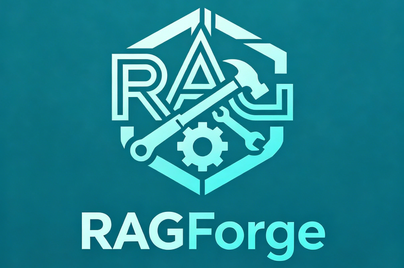

<div align="center">
  
</div>

<h1 align="center">RAGForge</h1>

<p align="center">
  <strong>Modular, composable RAG retrieval library —— Build your retrieval pipeline like forging parts</strong>
</p>

<div align="center">

README：[English](README_EN.md) | [中文](README.md)

</div>

<p align="center">
  <strong>CPU-only, minimal dependencies, one library for the entire RAG retrieval pipeline.</strong>
</p>

<p align="center">
  Embedding & Rerank — fully ONNX CPU inference, no GPU required.<br>
  Query understanding optionally via DeepSeek API, with local small-model support coming soon.<br>
  <strong>6 Protocol interfaces · 10+ composable components · X-Ray-level tracing</strong>
</p>

<p align="center">
  <a href="#why-ragforge">Why</a> ·
  <a href="#30-second-quick-start">Quick Start</a> ·
  <a href="#x-ray-tracing">X-Ray</a> ·
  <a href="#feature-panorama">Features</a> ·
  <a href="#architecture">Architecture</a> ·
  <a href="#installation">Install</a>
</p>

---

## 💡 Why RAGForge

What do you actually need to build a RAG retrieval pipeline?

- An Embedding model to vectorize text
- A Reranker to fine-rank candidate documents
- BM25 + vector hybrid retrieval
- RRF fusion to merge two ranked lists
- Query rewrite, decomposition, HyDE, and other query understanding techniques
- An evaluation framework for parameter tuning

LangChain and LlamaIndex can do all of this — but they're **full-stack frameworks**. Pulling them in means importing hundreds of dependencies you'll never use. Worse, they're **black boxes**: you can't see how many points BM25 assigned to each document, why rankings shifted after RRF fusion, or how raw logits map to final scores.

**RAGForge's philosophy: do one thing — the retrieval pipeline — and do it to perfection, with full transparency.**

| | LangChain | LlamaIndex | **RAGForge** |
|---|:---:|:---:|:---:|
| **Focus** | Full-stack LLM framework | Full-stack RAG framework | **Retrieval pipeline only** |
| **CPU Inference** | Depends on external libs | Depends on external libs | ✅ **Embedding + Rerank all CPU** |
| **GPU Required** | Often yes | Often yes | ✅ **Never** |
| **Hybrid Retrieval** | ✅ But black-box | ✅ But black-box | ✅ Every step traceable |
| **RRF Fusion** | Basic implementation | Not built-in | ✅ Bonus + Adaptive |
| **X-Ray Debugging** | ❌ | ❌ | ✅ **Unique** |
| **Query Understanding** | Basic | Basic | ✅ Multi-Query + HyDE |
| **LLM Evaluation** | Generic | Generic | ✅ Purpose-built for retrieval |
| **Pluggable Components** | Limited | Limited | ✅ Protocol interfaces |
| **Vector DB Coupling** | ❌ Coupled | ❌ Coupled | ✅ Agnostic |
| **Zero External Deps** | ❌ | ❌ | ✅ BM25 works standalone |

> **In a nutshell**: Need just BM25? 3 lines of code. Need Hybrid + Rerank + Multi-Query + X-Ray + A/B evaluation? Every feature at your fingertips. **And it all runs on CPU — no GPU required.**

---

## ⚡ 30-Second Quick Start

Install：pip install ragforge-sdk

### Minimal: Pure keyword search (zero dependencies)

```python
from ragforge import SearchPipeline, BM25Retriever

pipeline = SearchPipeline(retriever=BM25Retriever())
results = pipeline.search("apple phone price", ["iPhone 15 pricing", "Huawei phone specs"])
for doc, score in results:
    print(f"  {score:.4f} → {doc}")
```

No Embedding, no vector store, no GPU. Just `jieba` + `rank_bm25`.

### Full: Hybrid + Rerank + Blend + X-Ray

```python
from ragforge import (
    SearchPipeline, FastembedEmbedder, FastembedReranker,
    ModelConfig, PipelineConfig,
)

model_cfg = ModelConfig(
    embedding_model_path="/path/to/multilingual-e5-small-onnx",
    rerank_model_path="/path/to/bge-reranker-v2-m3-ONNX",
)

pipeline = SearchPipeline(
    embedder=FastembedEmbedder(model_cfg),
    reranker=FastembedReranker(model_cfg),
)

query = "How much does an iPhone cost"
documents = ["iPhone 15 starting price", "Apple phone official pricing", "Samsung Galaxy price"]

results, trace = pipeline.search(query, documents, trace=True)
print(trace.formatted)
```

> **100% CPU inference.** The Embedding model is ~400MB, the Reranker is ~500MB (int8 quantized). Auto-downloaded on first use and cached to `~/.cache/RAGForge/`. No CUDA, no GPU drivers needed.

### Standalone component usage

```python
from ragforge import BM25Retriever, VectorRetriever, FastembedEmbedder

# Standalone BM25
bm25 = BM25Retriever()
results = bm25.retrieve("query", ["doc1", "doc2"])

# Standalone vector retrieval
embedder = FastembedEmbedder(ModelConfig())
vector = VectorRetriever(embedder)
results = vector.retrieve("query", ["doc1", "doc2"])
```

---

## 🔬 X-Ray Tracing

RAGForge's **killer feature**.

Most RAG tools only show you the final ranked results. RAGForge's X-Ray tracing exposes **every internal computation** — the exact score of each document at each pipeline stage.

```python
results, trace = pipeline.search(query, documents, trace=True)
print(trace.xray)
```

```
Step Time Output
Retrieval 1917.6ms 3 candidates
Rerank 1834.1ms 3 docs reranked
Blend 0.0ms 3 results blended
Final Results:
Top1 0.3087 Official pricing of Apple iPhones
Top2 0.2821 Price of iPhone 15
Top3 0.0640 Huawei mobile phone quotation
Query: How much does an Apple iPhone cost
Total: 3751.8ms
┌─ BM25 Retrieval ─────────────────────────────────────────
│ "Official pricing of Apple iPhones " BM25= 0.6 rank=1
│ "Price of iPhone 15 " BM25= 0.5 rank=2
│ "Huawei mobile phone quotation " BM25= 0.1 rank=3
└────────────────────────────────────────────────────────────
┌─ Vector Retrieval ─────────────────────────────────────────
│ "Official pricing of Apple iPhones " cos_sim=0.9609 rank=1
│ "Price of iPhone 15 " cos_sim=0.9362 rank=2
│ "Huawei mobile phone quotation " cos_sim=0.9250 rank=3
└────────────────────────────────────────────────────────────
┌─ RRF Fusion ─────────────────────────────────────────
│ "Official pricing of Apple iPhones " rrf=0.0645 +bonus_rank1=0.05 → 0.1145
│ "Price of iPhone 15 " rrf=0.0635 +bonus_rank2_3=0.02 → 0.0835
│ "Huawei mobile phone quotation " rrf=0.0625 +bonus_rank2_3=0.02 → 0.0825
└────────────────────────────────────────────────────────────
┌─ Rerank ────────────────────────────────────────────
│ "Official pricing of Apple iPhones " logit= 2.1 sigmoid=0.891 "Highly relevant"
│ "Price of iPhone 15 " logit= 2.0 sigmoid=0.878 "Highly relevant"
│ "Huawei mobile phone quotation " logit= -4.7 sigmoid=0.009 "Low relevance"
└────────────────────────────────────────────────────────────
┌─ Blend ─────────────────────────────────────────────
│ "Official pricing of Apple iPhones " 0.1145×0.75 + 0.891×0.25 = 0.3087
│ "Price of iPhone 15 " 0.0835×0.75 + 0.878×0.25 = 0.2821
│ "Huawei mobile phone quotation " 0.0825×0.75 + 0.009×0.25 = 0.0640
└────────────────────────────────────────────────────────────
════════════════════════════════════════════════════════════
FINAL RESULTS:
#1 0.3087 Official pricing of Apple iPhones ← FINAL #1
#2 0.2821 Price of iPhone 15 ← FINAL #2
#3 0.0640 Huawei mobile phone quotation ← FINAL #3
```

> See at a glance *why* each document landed where it did — was it BM25? Rerank? How were weights distributed? No more guessing when tuning parameters.

---

## 🗺️ Feature Panorama

### 🔎 Retrieval Core

| Feature | Description | Inference |
|---------|-------------|-----------|
| **Hybrid Retrieval** | BM25 + Dense Vector parallel retrieval | CPU |
| **RRF Fusion** | Reciprocal Rank Fusion + Top-Position Bonus | CPU |
| **Cross-Encoder Reranking** | ONNX Reranker (int8 quantized) + Sigmoid normalization | CPU |
| **Position-Aware Blending** | Dynamic retrieval-score / rerank-score weight by rank bucket | CPU |
| **Adaptive Fusion** | Auto-learn optimal RRF parameters from feedback | CPU |

### 🧠 Query Understanding

| Feature | Description | Inference |
|---------|-------------|-----------|
| **Query Rewrite** | Colloquial query → retrieval-friendly query | DeepSeek API / Local small model (planned) |
| **Query Decomposition** | Multi-intent query → 2–4 sub-queries | DeepSeek API / Local small model (planned) |
| **HyDE** | Generate hypothetical answer document for better vector recall | DeepSeek API / Local small model (planned) |
| **Query Expansion** | Synonym / related-term expansion | DeepSeek API / Local small model (planned) |
| **Multi-Query Retrieval** | Original + rewritten queries retrieve separately → RRF fusion | CPU + API |

> **Design philosophy**: The retrieval pipeline's core computation (Embedding, BM25, Rerank, Fusion) runs entirely on local CPU with **zero external API dependencies**. Query understanding (Rewrite, HyDE, etc.) currently uses the DeepSeek API, with support for local small models (e.g., Qwen2.5-1.5B, DeepSeek-R1-Distill) planned for fully offline deployment.

### 🔭 Observability

| Feature | Description |
|---------|-------------|
| **X-Ray Trace** | Exact per-document score at every pipeline step (**unique**) |
| **Pipeline Trace** | Per-step timing + summary |
| **Latency Profiler** | Per-step duration + percentage breakdown |

### 📊 Evaluation

| Feature | Description |
|---------|-------------|
| **LLM-as-Judge** | DeepSeek-powered automatic relevance judgment |
| **Metrics** | NDCG / Recall / Precision / MRR |
| **A/B Comparison** | Side-by-side comparison of two pipeline configurations |

### 🛠 Engineering

| Feature | Description |
|---------|-------------|
| **Semantic Cache** | Vector-similarity-based result caching |
| **Document Dedup** | Vector-similarity-based document deduplication |
| **Protocol-Based** | 6 interfaces — every component is swappable |
| **Zero Global State** | All dependencies explicitly injected |
| **Lazy Loading** | Models loaded on first use, auto-cached |

---

## 📖 Detailed Usage
demo.py for details

<details>
<summary><b>🔧 Query Understanding (DeepSeek API)</b></summary>

```python
from ragforge import QueryPlanner, LLMConfig

llm_cfg = LLMConfig(api_key="sk-your-deepseek-key")
planner = QueryPlanner(llm_cfg)

# Rewrite: colloquial → retrieval-friendly
rewritten = planner.rewrite("How much does an iPhone cost")
# → "Apple iPhone series price pricing official retail"

# Decompose: multi-intent → sub-queries
sub_queries = planner.decompose("Compare iPhone and Huawei camera quality")
# → ["iPhone camera quality review", "Huawei phone camera quality review", "iPhone vs Huawei camera comparison"]

# HyDE: generate hypothetical answer
hypothetical = planner.hyde("What is RAG")
# → "RAG (Retrieval-Augmented Generation) is a technique that combines retrieval..."

# Expand: synonyms
expansions = planner.expand("deep learning")
# → ["neural network", "machine learning", ...]
```

</details>

<details>
<summary><b>🔄 Multi-Query Retrieval (Original + Rewritten Retrieve Separately)</b></summary>

```python
from ragforge import (
    SearchPipeline, QueryPlanner, RRFFusion, PositionAwareBlend,
    FastembedEmbedder, FastembedReranker,
    ModelConfig, PipelineConfig, LLMConfig, QueryTransformStrategy,
)

pipe_cfg = PipelineConfig(
    query_transform_strategy=QueryTransformStrategy.RETRIEVE_AND_FUSE,
)

pipeline = SearchPipeline(
    embedder=FastembedEmbedder(model_cfg),
    reranker=FastembedReranker(model_cfg),
    fusion=RRFFusion(pipe_cfg),
    blend=PositionAwareBlend(pipe_cfg),
    query_transform=QueryPlanner(LLMConfig(api_key="sk-...")),
    config=pipe_cfg,
)

# Original query + rewritten query → parallel retrieval → RRF fusion
results, trace = pipeline.search("How much does an iPhone cost", documents, trace=True)
```

Flow:
```
query ──► [Rewrite] ─┬──► [Retrieve: original query]  ──┐
                    └──► [Retrieve: rewritten query] ──┼──► [RRF Fusion] ──► [Rerank] ──► results
```

> 💡 Also supports `decompose()` — original + N sub-queries → (N+1)-way parallel retrieval, all fused.

</details>

<details>
<summary><b>📊 Evaluation & A/B Comparison</b></summary>

```python
from ragforge import Evaluator, LLMJudge, LLMConfig

judge = LLMJudge(LLMConfig(api_key="sk-..."))
evaluator = Evaluator(judge=judge)

# Evaluate pipeline quality
metrics = evaluator.evaluate(pipeline, queries, ground_truth, top_k=5)
print(f"NDCG@5: {metrics.ndcg:.3f}, Recall@5: {metrics.recall:.3f}, MRR: {metrics.mrr:.3f}")

# A/B compare two pipelines
comparison = evaluator.compare(
    pipeline_a=hybrid_pipeline,
    pipeline_b=bm25_only_pipeline,
    queries=queries,
    ground_truth=ground_truth,
)
print(comparison["report"])
```

```
Pipeline Comparison Report
======================================================================
Metric                Pipeline A  Pipeline B
--------------------------------------------
NDCG@5                    0.8200      0.6100
Recall@5                  0.9000      0.7000
Precision@5               0.7200      0.5200
MRR                       0.9500      0.7500
Avg Latency (ms)         320.0       12.0
```

</details>

<details>
<summary><b>⚡ Adaptive Fusion (Learn from Feedback)</b></summary>

```python
from ragforge import AdaptiveFusion

feedback = [
    ("iPhone price", {"iPhone 15 official price $599", "Apple store pricing"}),
    ("Python tutorial", {"Python beginner guide", "Python best practices"}),
]

fusion = AdaptiveFusion.from_feedback(feedback)
print(f"Best: k={fusion.best_config.rrf_k}, weight={fusion.best_config.query_weight}")

pipeline = SearchPipeline(fusion=fusion)
```

</details>

<details>
<summary><b>📦 Semantic Cache & Document Dedup</b></summary>

```python
# Semantic cache: similar queries return cached results
from ragforge import SemanticCache
cache = SemanticCache(embedder=embedder, similarity_threshold=0.95)
result1 = cache.get_or_search("iPhone price", pipeline.search, documents)
result2 = cache.get_or_search("how much is iPhone", pipeline.search, documents)  # cache hit
print(cache.stats)  # {'entries': 1, 'hits': 1, 'misses': 0, 'hit_rate': 1.0}

# Document dedup: vector-similarity based
from ragforge import Deduplicator
dedup = Deduplicator(embedder=embedder, threshold=0.95)
unique = dedup.deduplicate(documents)
print(f"{len(documents)} → {len(unique)} unique documents")
```

</details>

<details>
<summary><b>🎨 Custom Components (Protocol Interfaces)</b></summary>

```python
# Just implement the interface methods — no base class inheritance needed
class MyRetriever:
    def retrieve(self, query: str, documents: list[str]) -> list[tuple[str, int]]:
        # Your retrieval logic
        return [(doc, rank) for rank, doc in enumerate(sorted_docs)]

# Swap in OpenAI Embedding
class OpenAIEmbedder:
    def __init__(self, api_key): ...
    def embed(self, text: str) -> np.ndarray: ...
    def embed_batch(self, texts: list[str]) -> list[np.ndarray]: ...

# Drop it straight into the pipeline
pipeline = SearchPipeline(retriever=MyRetriever())
```

</details>

---

## 🏛 Architecture

### Pipeline Flow

```
query ──► [Query Transform] ──► [Retriever] ──► [Fusion] ──► [Rerank] ──► [Blend] ──► results
              optional           always       if hybrid    optional    optional
```

Multi-Query mode:

```
query ──► [Transform] ─┬──► [Retrieve: original query]  ──┐
                      ├──► [Retrieve: rewritten query] ──┼──► [RRF Fusion] ──► [Rerank] ──► [Blend] ──► results
                      └──► [Retrieve: sub-query 3]   ──┘
```

### Protocol Interfaces

```python
class Embedder(Protocol):
    def embed(self, text: str) -> np.ndarray: ...
    def embed_batch(self, texts: list[str]) -> list[np.ndarray]: ...

class Retriever(Protocol):
    def retrieve(self, query: str, documents: list[str]) -> list[tuple[str, int]]: ...

class Reranker(Protocol):
    def rerank(self, query: str, documents: list[str]) -> list[float]: ...

class FusionStrategy(Protocol):
    def fuse(self, ranked_lists: list[list[tuple[str, int]]]) -> list[tuple[str, float]]: ...

class QueryTransform(Protocol):
    def transform(self, query: str) -> str | list[str]: ...

class Judge(Protocol):
    def judge(self, query: str, documents: list[str]) -> list[dict]: ...
```

### Project Structure

```
ragforge/
├── protocols.py                 # 6 Protocol interface definitions
├── type_utils.py                # Shared data types + X-Ray formatting
├── pipeline.py                  # SearchPipeline (assembles all components)
│
├── config/
│   ├── model_config.py          # Model path configuration
│   ├── pipeline_config.py       # Algorithm hyperparameters + QueryTransformStrategy
│   └── llm_config.py            # DeepSeek LLM configuration
│
├── models/                      # ONNX CPU inference models
│   ├── embedding.py             # FastembedEmbedder (ONNX)
│   └── reranker.py              # FastembedReranker (ONNX, int8)
│
├── retrieval/
│   ├── bm25.py                  # BM25Retriever (jieba)
│   ├── vector.py                # VectorRetriever (cosine similarity)
│   └── hybrid.py                # HybridRetriever (parallel)
│
├── fusion/
│   ├── rrf.py                   # RRFFusion (bonus + adaptive)
│   ├── blend.py                 # PositionAwareBlend
│   └── adaptive.py              # AdaptiveFusion (auto-tuned)
│
├── llm/
│   └── llm_client.py              # LLMClient (OpenAI-compatible)
│
├── query/
│   └── planner.py               # QueryPlanner (rewrite / decompose / hyde / expand)
│
├── evaluation/
│   ├── judge.py                 # LLMJudge (LLM-as-Judge)
│   └── evaluator.py             # Evaluator (NDCG / Recall / MRR + A/B)
│
├── cache/                       # SemanticCache
├── dedup/                       # Deduplicator
├── tracing/                     # Tracer
└── profiler.py                  # PipelineProfiler
```

---

## ⚙️ Configuration

### ModelConfig

| Parameter | Type | Default | Description |
|-----------|------|---------|-------------|
| `embedding_model_path` | `str \| None` | `None` | Embedding model path (auto-download if None) |
| `embedding_dim` | `int` | `384` | Vector dimension |
| `rerank_model_path` | `str \| None` | `None` | Reranker model path (auto-download if None) |

### PipelineConfig

| Parameter | Type | Default | Description |
|-----------|------|---------|-------------|
| `rrf_k` | `int` | `60` | RRF constant |
| `top_k_recall` | `int` | `30` | Candidates to keep after fusion |
| `query_weight` | `float` | `2.0` | RRF score weight |
| `bonus_rank1` | `float` | `0.05` | Rank-1 bonus |
| `bonus_rank2_3` | `float` | `0.02` | Rank 2–3 bonus |
| `query_transform_strategy` | `str` | `"replace"` | `"replace"` or `"retrieve_and_fuse"` |
| `blend_weights` | `dict` | See source | Weight buckets by rank range |

### LLMConfig

| Parameter | Type | Default | Description |
|-----------|------|---------|-------------|
| `api_key` | `str` | `""` | DeepSeek API Key |
| `base_url` | `str` | `"https://api.deepseek.com"` | API endpoint |
| `model` | `str` | `"deepseek-v4-flash"` | Model name |

---

## API Reference

### Retrieval Components

| Class | Interface | Description | Inference |
|-------|-----------|-------------|-----------|
| `FastembedEmbedder` | `Embedder` | ONNX Embedding (multilingual-e5-small) | CPU |
| `FastembedReranker` | `Reranker` | ONNX Cross-Encoder (bge-reranker-v2-m3, int8) | CPU |
| `BM25Retriever` | `Retriever` | BM25 full-text retrieval (jieba tokenization) | CPU |
| `VectorRetriever` | `Retriever` | Cosine similarity vector retrieval | CPU |
| `HybridRetriever` | `Retriever` | BM25 + Vector parallel | CPU |
| `RRFFusion` | `FusionStrategy` | RRF + Top-Position Bonus | CPU |
| `PositionAwareBlend` | `FusionStrategy` | Position-aware weight blending | CPU |
| `AdaptiveFusion` | `FusionStrategy` | Feedback-driven parameter auto-tuning | CPU |
| `SearchPipeline` | — | Composable pipeline | CPU |

### Query & Evaluation

| Class | Interface | Description | Inference |
|-------|-----------|-------------|-----------|
| `QueryPlanner` | `QueryTransform` | Rewrite / Decompose / HyDE / Expand | API (DeepSeek) |
| `LLMJudge` | `Judge` | LLM relevance judgment | API (DeepSeek) |
| `Evaluator` | — | NDCG / Recall / MRR + A/B | API + CPU |

### Engineering Components

| Class | Description |
|-------|-------------|
| `SemanticCache` | Vector-similarity result caching |
| `Deduplicator` | Near-duplicate document removal |
| `Tracer` | Step-level pipeline tracing |
| `PipelineProfiler` | Latency profiling |

---

## 📦 Installation

### Core dependencies (retrieval features, CPU-only)

```bash
pip install fastembed rank_bm25 jieba scikit-learn numpy requests
```

### LLM features (Query Understanding, Evaluation) — optional

```bash
pip install openai  # DeepSeek is OpenAI-compatible
```

> **No problem if you skip `openai`.** BM25, Embedding, Rerank, RRF, and Blend all work independently. You only need the LLM dependency when you want Query Rewrite, HyDE, or LLM-based evaluation.

### Default Models

| Component | Model | Size | Quantization | Inference |
|-----------|-------|------|-------------|-----------|
| Embedding | multilingual-e5-small-onnx | ~400MB | FP16 | **CPU** |
| Reranker | bge-reranker-v2-m3-ONNX-int8 | ~500MB | int8 | **CPU** |

Source: [ModelScope](https://modelscope.cn/profile/jiangnanboy)

Auto-downloaded to `~/.cache/RAGForge/` on first use with lazy loading.

---

## License

Apache2.0 License — see the [LICENSE](LICENSE) file for details.

